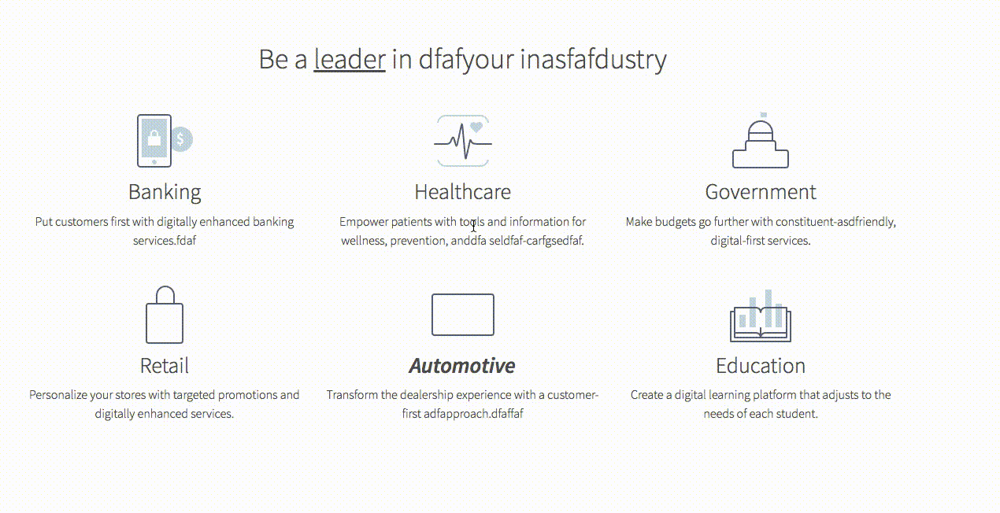

# Live Editor

Live Editor a UI for WYSIWYG to make live edit to changes. This is a front-end implementation only and the server-side implementation is up to the user.

It has 0 dependencies and runs with ES6 syntax;

## Table of Contents
1. [Demo](#demo)
2. [Usage](#usage)
3. [Developing](#developing)

## Demo



## Usage

Live Editor looks for a class selection in your HTML so know should be editable. Pass it a selector and it should work:

```
var editable = document.querySelector('.edit-this')

editor.activate(editable);
```

## Developing

To build off or edit this plugin:

1. Install development dependencies: `npm install`
2. Start gulp `gulp`

*It's now watching for changes*
